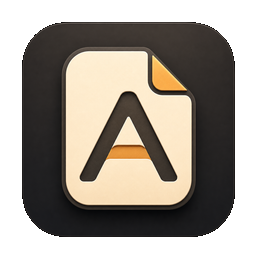

<p align="center">
  <a href="https://github.com/Ceeon/agentfile">
    
  </a>
  <br/>
</p>

# Agentfile

Agentfile is a customized open-source fork of [Wave Terminal](https://github.com/wavetermdev/waveterm).
It keeps Wave Terminal's terminal, block workspace, file preview, remote access, and `wsh` foundations while adding Agentfile-specific local workflow changes.

This repository is treated as a continuously editable local app. In development, the user-facing product surface is the Electron window named **Agentfile**. The Vite URL, usually `http://localhost:5173/`, is only the internal Electron renderer dev server and should not be presented as the app itself.

## What Changed

See [AGENTFILE-CHANGELOG.md](./AGENTFILE-CHANGELOG.md) for the running modification log. Current notable customizations include:

- Agentfile branding for package metadata, Electron app name, window title, dock icon, and local dev app bundle.
- VSCode-style tree file browser with drag-and-drop move.
- Removed AI button from the tab bar.
- Block rename functionality.
- Data isolation from the original Wave directories using `waveterm2` / `waveterm2-dev`.
- Project-level development skill for agents at [.claude/skills/agentfile-dev/SKILL.md](./.claude/skills/agentfile-dev/SKILL.md).

## Open Source License And Attribution

Agentfile is distributed under the [Apache License 2.0](./LICENSE) as a modified fork of Wave Terminal.

The original Wave Terminal project is copyright 2025 Command Line Inc. Agentfile modifications are copyright 2026 Ceeon and Agentfile contributors unless otherwise noted. The upstream attribution and fork notices are retained in [NOTICE](./NOTICE). Dependency acknowledgements are listed in [ACKNOWLEDGEMENTS.md](./ACKNOWLEDGEMENTS.md).

When redistributing Agentfile source or binaries:

- Include the Apache-2.0 [LICENSE](./LICENSE).
- Keep [NOTICE](./NOTICE) with the upstream Wave Terminal attribution and Agentfile modification notice.
- Preserve relevant copyright, license, trademark, and attribution notices from upstream source files.
- Mark modified files where required by Apache-2.0 section 4.

## Running Locally

```bash
# Quick local development on arm64 macOS
task electron:quickdev

# General development with hot reload
task dev

# Run the built app without the dev server
task start
```

The quick development path prepares the local Electron app bundle as `Agentfile.app` and runs the app against the dev renderer. It is the default path for day-to-day Agentfile work.

Important: `task package` creates installable artifacts and performs a clean. Do not use it for normal local validation unless the task is specifically to build an installer.

## Project Skill

Agents working in this repository should use the project skill when starting, diagnosing, or validating Agentfile:

```bash
.claude/skills/agentfile-dev/scripts/agentfile-dev.sh status
.claude/skills/agentfile-dev/scripts/agentfile-dev.sh diagnose
.claude/skills/agentfile-dev/scripts/agentfile-dev.sh run
```

The skill documents the expected dev data paths, platform-specific commands, and the rule that `localhost:5173` is an internal renderer service rather than a user-facing website.

## Maintainer And Contact

Agentfile is maintained by Chengfeng / Ceeon.

- GitHub project: https://github.com/Ceeon/agentfile
- X / Twitter: https://x.com/chengfeng240928
- Xiaohongshu: `AI产品自由` / `1051267243`
- WeChat search: `AI产品自由`

For bugs and feature requests, use GitHub Issues when possible. For collaboration, feedback, or broader discussion, use the social links above.

<p>
  
</p>

## Architecture

Agentfile keeps Wave Terminal's Electron + Go architecture:

- **Frontend**: React 19, TypeScript, Electron, Jotai, Tailwind CSS.
- **Main process**: Electron main process in [emain/](./emain/).
- **Backend**: Go server and shell helpers in [cmd/](./cmd/) and [pkg/](./pkg/).
- **Communication**: WebSocket JSON-RPC between the renderer and `wavesrv`.

Key directories:

```text
frontend/app/       React application
emain/              Electron main and preload process code
cmd/server/         wavesrv entrypoint
cmd/wsh/            Wave Shell Extensions entrypoint
docs/engineering-notes/aiprompts  Upstream engineering notes and AI prompt references
pkg/wshrpc/         RPC types and handlers
pkg/blockcontroller Block lifecycle
pkg/shellexec/      Shell process execution
pkg/remote/         SSH connections
```

## Development Commands

```bash
# Initialize development environment
task init

# Build backend only
task build:backend

# Build server only
task build:server

# Build Electron/frontend dev bundle
npm run build:dev

# Run tests
npm run test

# Run coverage
npm run coverage
```

If you need to package, force a fresh backend build first because the package task cleans generated output:

```bash
rm -rf dist make && task build:server && task package
```

## Data And Logs

Development data is isolated from other Wave/Agentfile installs:

- macOS data: `~/Library/Application Support/waveterm2-dev`
- macOS config: `~/.config/waveterm2-dev`
- Log file: `waveapp.log` inside the data directory

Do not clear development data unless the task explicitly asks for a reset.

## Upstream Links

Agentfile is based on Wave Terminal. For upstream project context, see:

- Upstream repository: https://github.com/wavetermdev/waveterm
- Upstream documentation: https://docs.waveterm.dev
- Upstream website: https://www.waveterm.dev
